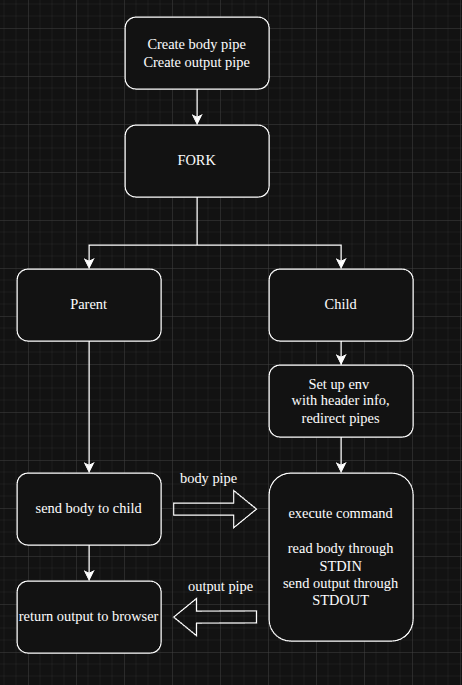

# Webserv

A lightweight HTTP/1.1 web server written in C++98, built as part of the [42](https://42.fr) curriculum.

> *Created by [jholterh](https://github.com/jholterh) and [tdeliot](https://github.com/tdeliot)*

---

## Description

Webserv is a lightweight HTTP/1.1 web server written in C++98. It handles **GET**, **POST**, and **DELETE** requests, serves static files, supports CGI script execution, file uploads, directory listing, HTTP redirections, cookies and sessions, and multiple virtual server configurations. The server uses a single `epoll` instance for non-blocking I/O multiplexing.

### Features

- HTTP/1.1 compliant (GET, POST, DELETE)
- Static file serving
- Directory listing
- CGI script execution (Python, PHP, ...)
- File uploads
- HTTP redirections
- Cookies & sessions
- Multiple virtual server configurations
- Non-blocking I/O via `epoll`

---

## Demo

**Basic usage**

https://github.com/user-attachments/assets/d8ee2fcd-5cd6-4fc4-a076-c93d83813041

**Own tester**

https://github.com/user-attachments/assets/1eb89365-5086-4a0c-b59a-5b0b75e8bd69

**Test siege**

https://github.com/user-attachments/assets/a130ae8e-42d6-42ad-b48d-a06b5c4c9cfe

---

## Architecture

<p align="center">
  <br/><em>L1 : System Context</em>
  
</p>

<p align="center">
  <br/><em>L2 : Components</em>
  
</p>

---

## How does it work?

The server runs on a single `epoll` event loop that multiplexes all client connections and CGI pipes without blocking.

<p align="center">
  <br/><em>Epoll Loop Overview</em>
  
</p>

<p align="center">
  <br/><em>CGI Overview</em>
  
</p>

---

## Getting Started

### Prerequisites

Run the setup script once to install dependencies:

```bash
./RUN_ME_ONCE.sh
```

### Compile

```bash
cd webserv
make
```

### Run

```bash
./webserv config.conf
```

Then open `http://127.0.0.1:8080` in your browser.

### Run Tests

```bash
cd testeur_webserver
make
./testeur_webserver
```

---

## Resources

- [RFC 7230 — HTTP/1.1 Message Syntax and Routing](https://datatracker.ietf.org/doc/html/rfc7230)
- [RFC 7231 — HTTP/1.1 Semantics and Content](https://datatracker.ietf.org/doc/html/rfc7231)
- [RFC 3875 — The Common Gateway Interface (CGI)](https://datatracker.ietf.org/doc/html/rfc3875)
- [epoll(7) — Linux I/O event notification](https://man7.org/linux/man-pages/man7/epoll.7.html)
- [NGINX beginners guide](https://nginx.org/en/docs/beginners_guide.html)

---

## AI Usage

AI tools (Claude) were used during development for:
- Debugging HTTP parsing edge cases and CGI environment variable setup
- Reviewing code for compliance with the 42 subject requirements
- Generating test cases for chunked transfer encoding
